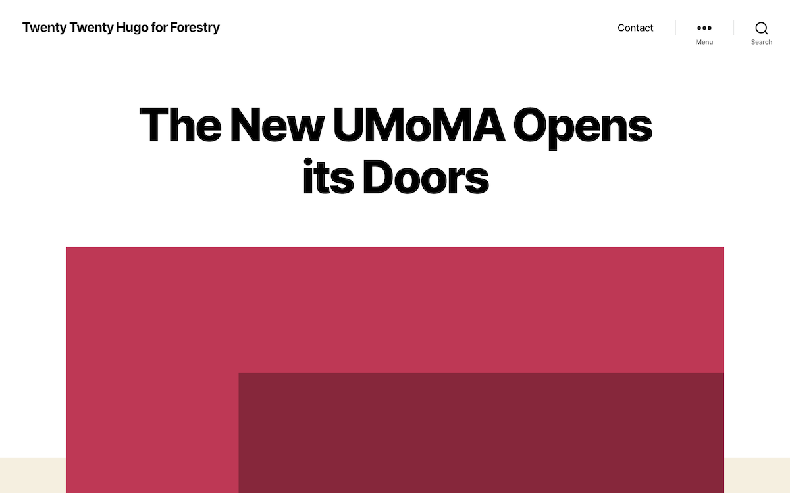
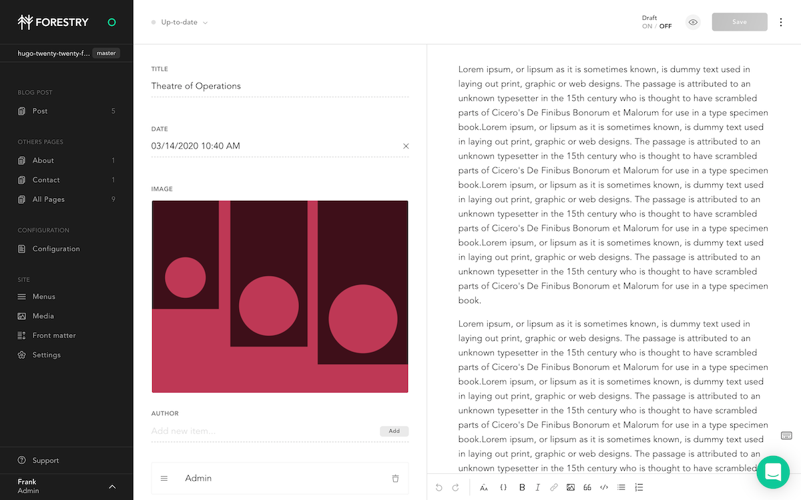

# Hugo Twenty Twenty Forestry starter

[Kross Hugo theme](https://github.com/themefisher/twenty-twenty-hugo) is developed by Themefisher.

[Live Preview](https://hugo-twenty-twenty-forestry.vercel.app/)




## Requirements

- GitHub, GitLab or BitBucket account
- Hugo > 0.62.2

## Content Management

[](https://app.forestry.io/quick-start?repo=DirtyF/hugo-twenty-twenty-forestry&engine=hugo&version=0.74.1)



This project has been pre-configured to work with [Forestry](https://forestry.io) a git-based CMS, [import your repository in Forestry](https://app.forestry.io/quick-start?repo=DirtyF/hugo-twenty-twenty-forestry&engine=hugo&version=0.74.1) and you'll be able to edit and preview your site ✨. \

Any changes you make in Forestry will be commited back to the repo and automatically deployed, e.g with [Vercel](#vercel) or [Netlify](#netlify).

## Local development

```bash
# clone your imported repository
# cd in the project directory
# Start local dev server
hugo server
```

## Deployment and hosting

### Vercel

[](https://zeit.co/new/project?template=https://github.com/forestryio/kross-hugo-starter)

Copy-paste your Git repository URL, accept default settings and click deploy ✨.

### Netlify

[](https://app.netlify.com/start/deploy?repository=https://github.com/hugo-twenty-twenty-forestry)

1. Set the build command to: `hugo --gc --minify`
2. Set the publish directory to: `public`
3. Make sure to set `HUGO_VERSION` to 0.62.2 or above (tested with 0.74.1)
3. Set the publish directory to: `public`

That's it, now your site gets deployed automatically on `git push` or when saving documents from Forestry.

## Feedback

[Open an issue](https://github.com/themefisher/twenty-twenty-hugo/issues) in the theme's repository.

## LICENSE

[GNU General Public License v2.0](https://github.com/themefisher/twenty-twenty-hugo/blob/master/LICENSE).
